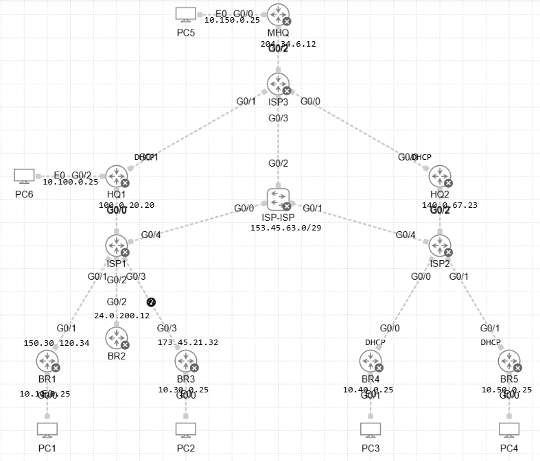

# 📡 DMVPN 02

## 📘 Project Overview

This project provides a lab environment built in **Cisco CML** for hands-on practice with **DMVPN (Dynamic Multipoint VPN)**.

The lab **DMVPN_02.yaml** is pre-configured with:

- IP addressing,
- Underlay routing

## 🧪 Environment

- **Platform:** Cisco CML
- **Router Type:** IOSv 

## 🎯 Task

Your task is to configure **Hierarchical IPv4overIPv4 DMVPN Phase 3 with IPSec** between MHQ router, HQ1 and HQ2 routers, BR routers by implementing **Next Hop Resolution Protocol (NHRP)**, **IPSec in transport mode (IKEv2)** and **EIGRP** as overlay network.

> 🔍 The specific instructions and scenarios are **embedded inside the lab** itself via notes. Please explore the CML simulation to discover them.

## 🖼️ Topology

Below is the high-level topology used in this lab:

## ✅ Goal

Once completed, your configuration should support working **Hierarchical IPv4overIPv4 DMVPN Phase 3 with IPSec**.

Compare your results with the example solution in the `solution/` directory.

Happy labbing! 🚀
