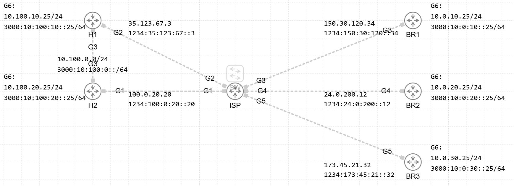

# 📡 DMVPN 05

## 📘 Project Overview

This project provides a lab environment built in **Cisco CML** for hands-on practice with **DMVPN (Dynamic Multipoint VPN)**.

The lab **DMVPN_05.yaml** is pre-configured with:

- IPv4 and IPv6 addressing,
- Underlay routing
- FVRF on H and BR routers 

## 🧪 Environment

- **Platform:** Cisco CML
- **Router Type:** ISR1000v

## 🎯 Task

Your task is to configure **IPv4overIPv6 DMVPN Phase 3 Dual Hub Single Cloud with IPSec** between H and BR routers with implementing, **Next Hop Resolution Protocol (NHRP)**, **IPSec in transport mode (IKEv2)** and **OSPFv2** as overlay network. 

Your task is to configure **IPv6overIPv4 DMVPN Phase 3 Dual Hub Dual Cloud with IPSec** between H and BR routers with implementing, **Next Hop Resolution Protocol (NHRP)**, **IPSec in transport mode (IKEv2)** and **EIGRP** as overlay network. 

> 🔍 The specific instructions and scenarios are **embedded inside the lab** itself via notes. Please explore the CML simulation to discover them.

## 🖼️ Topology

Below is the high-level topology used in this lab:

## ✅ Goal

Once completed, your configuration should support working **IPv4overIPv6 DMVPN Phase 3 Dual Hub Single Cloud with IPSec** and **IPv6overIPv4 DMVPN Phase 3 Dual Hub Dual Cloud with IPSec**.

Compare your results with the example solution in the `solution/` directory.

Happy labbing! 🚀
