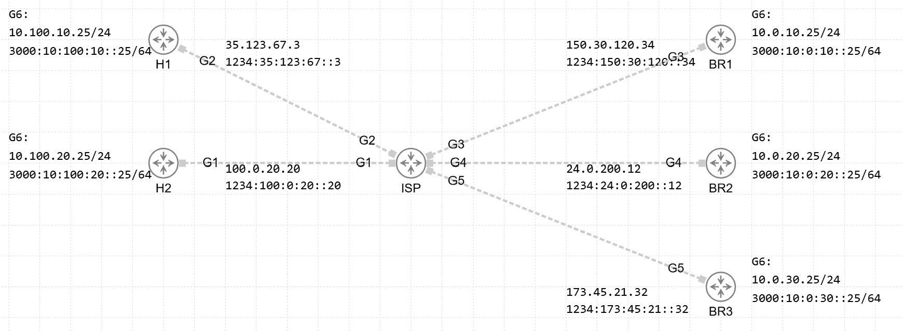

# DMVPN Playground with Front-Door VRF (FVRF)

## Overview
This CML lab is a **DMVPN playground** designed for learning and testing different DMVPN deployment models.  
The underlay routing is **fully operational**, and **Front-Door VRF (FVRF)** is implemented on the WAN-facing interfaces toward the ISP.

## Topology Summary
- **ISP router** providing IPv4 and IPv6 transport
- **2 hub router (H1, H2)**
- **3 spoke routers (BR1, BR2, BR3)**
- All WAN-facing links are placed in a **Front-Door VRF** named FDOOR-DMVPN
- The ISP acts purely as an underlay transport for DMVPN

## Underlay Addressing (Examples)
The lab uses both IPv4 and IPv6 addressing on the underlay:

## DMVPN Use Cases
This topology allows building and testing DMVPN in the following variants:

- **IP over IP**
- **IP over IPv6**
- **IPv6 over IP**
- **IPv6 over IPv6**

Supported DMVPN designs:
- **IPsec Phase 1, 2, and 3**
- **Single Hub / Single Cloud**
- **Dual Hub / Single Cloud**
- **Dual Hub / Dual Cloud**

## Purpose
This lab is a **hands-on playground**.  
No predefined DMVPN configuration is enforced – you choose what to deploy, test, break, and fix.

Enjoy experimenting 🚀
