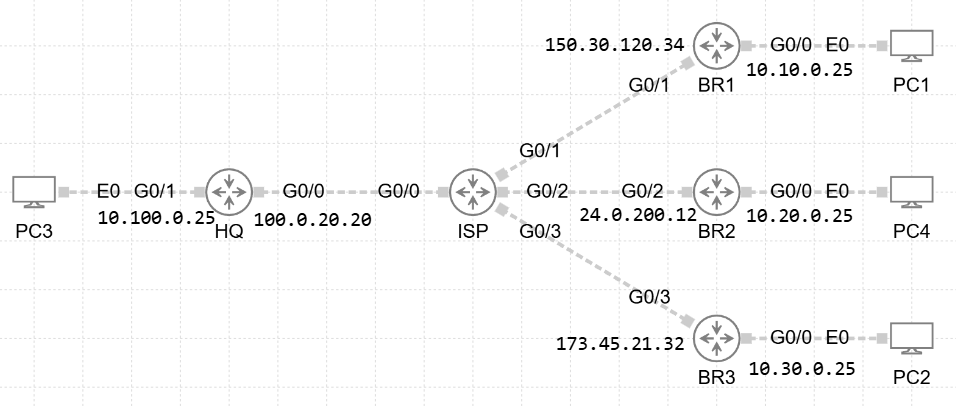

# 📡 Troubleshoot DMVPN 01

## 🖼️ Topology

Below is the high-level topology used in this lab:

## 🛠️ Lab Configuration Overview

- **Technology Stack:**
  - IPv4overIPv4 DMVPN Phase 2 (GRE over IPSec with ISAKMP)
  - Overlay Tunnel Network: `10.0.0.0/24`
  - Named EIGRP (AS 100) for dynamic routing
- **Key Devices:**
  - HQ (Hub)
  - BR1, BR2, BR3 (Spokes)
  - ISP (Transit/Internet Simulation)
  - PC1–PC4 (End devices connected to each branch)

## 🎯 Task

Problems:
Users from BR1 and BR3 are not able to access resources outside their brunch
Users from BR2 cannot access network 10.100.0.25

Troubleshooting TASKs:
All users should have full conectivity to each others 
