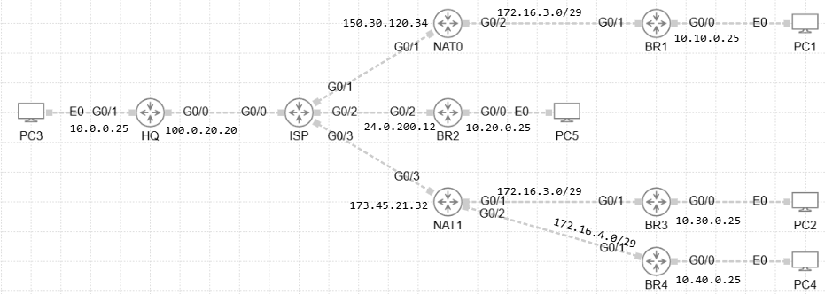

# 📡 Troubleshoot DMVPN 01

## 🖼️ Topology

Below is the high-level topology used in this lab:

## 🛠️ Lab Configuration Overview

- **Technology Stack:**
  - IPv4overIPv4 DMVPN Phase 3 (GRE over IPSec with IKEv2)
  - Overlay Tunnel Network: `192.168.0.0/24`
  - Named EIGRP (AS 100) for dynamic routing
- **Key Devices:**
  - HQ (Hub)
  - BR1, BR2, BR3, BR4 (Spokes)
  - BR4 has a week router and has some IPSec SA limitation
  - ISP (Transit/Internet Simulation)
  - NAT0, NAT1 (static NAT)
  - PC1–PC4 (End devices connected to each branch)

## 🎯 Task

Problems:
Users from BR1 and BR3 are complaining that they from time to time loosing conectivity with rest of corporate network
Users from BR4 cannot access rest of corporate network

Troubleshooting TASKs:
All users should have full conectivity to each others 
