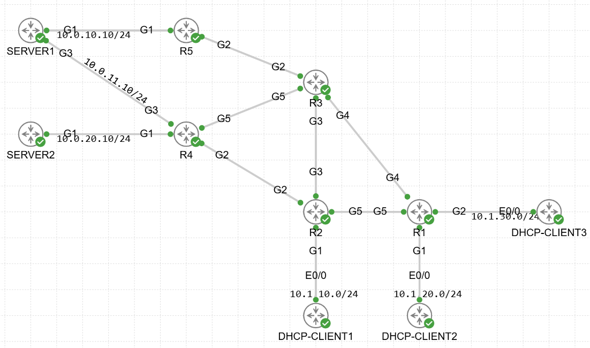

# 🔐 ENARSI – Services and Security Lab

## 📘 Project Overview

This project contains a **Cisco ENARSI–focused lab** built in **Cisco CML**, designed to practice configuration of **enterprise network services and security** in a **dual-stack IPv4 / IPv6 environment**.

The lab file **ENARSI_Lab_-_Services_and_Security.yaml** includes a prebuilt topology with routing already in place, allowing you to focus on **services, security, and infrastructure hardening**.

---

## 🧪 Environment

- **Platform:** Cisco CML
- **Device Types:**
  - CSR1000v Routers
  - IOL Routers
- **IP Stack:** Dual-Stack (IPv4 & IPv6)

---

## 🎯 Lab Objectives

Your task is to configure and secure **enterprise network services and security**, including:

### 📡 Network Services
- DHCPv4
- IPv6 SLAAC and DHCPv6
- Syslog
- SNMP
- NetFlow

### 🔐 Security
- AAA (local / centralized)
- SSH
- Control Plane protection
- ACL 
- uRPF
- PBR

> 🔍 Detailed requirements, hints, and constraints are embedded directly inside the **CML topology notes**.  
> Review them carefully before starting configuration.

---

## 🧠 Addressing Scheme (High Level)

### LAN Networks
- **IPv4:** `10.X.Y.R/24` (X < Y)
- **IPv6:** `3000:10:X:Y::R/64`

### Loopback Interfaces
- **IPv4:** `192.168.255.R/32`
- **IPv6:** `3000:192:168:255::R/128`

### Servers
| Device  | IPv4 Address        | IPv6 Address               |
|---------|---------------------|----------------------------|
| SERVER1 | 172.16.16.1/32      | 3000:172:16:16::1/128      |
| SERVER2 | 172.16.17.1/32      | 3000:172:16:17::1/128      |

### Clients
- **DHCP-CLIENT1**
  - IPv6 addressing via **SLAAC**

---

## 🖼️ Topology

High-level topology overview:

> Exact interface mappings and device roles are available inside the **CML lab file**.

---

## 🔒 Security Focus

This lab emphasizes **ENARSI-level best practices**, including:

- Secure management plane
- Infrastructure service protection
- Logging
- IPv4 and IPv6 service coexistence
- Enterprise-ready configuration standards

---

## ✅ Completion Criteria

The lab is considered complete when:

- All required services are operational
- IPv4 and IPv6 clients receive correct configuration
- Secure access to network devices is enforced
- Monitoring and logging services function correctly
- Configuration aligns with ENARSI design principles

---

## 🧪 Verification

Use appropriate **show** and **debug** commands to verify:

- Service reachability
- Address assignment
- Security posture
- Control-plane stability

---

## 🚀 Getting Started

1. Import the `.yaml` file into **Cisco CML**
2. Review all topology notes
3. Plan service placement and security strategy
4. Configure incrementally
5. Verify and document results

## ✅ Goal

Once completed, compare your results with the example solution in the `solution/` directory.

Happy labbing! 💪
