# 📸 Show Command Output - ENCOR CH1 Layer 2 Forwarding

Below is a set of screenshots showing the results of key `show` commands used to verify the lab configuration.

## 🧾 Commands used:

- `show vlan`
- `show vlan id 100`
- `show vlan name TASK-1`
- `show vlan brief`
- `show vlan summary`

- `show interfaces trunk`
- `show interfaces status`
- `show interfaces g0/0 switchport`

- `show mac address-table`
- `show mac address-table vlan 100`
- `show mac address-table interface g0/2`
- `show mac address-table dynamic`
- `show mac address-table address 5254.0016.5a34`
- `show mac address-table aging-time`

- `show ipv6 interface brief`

---

## 📷 Screenshot

### 🔹 show vlan
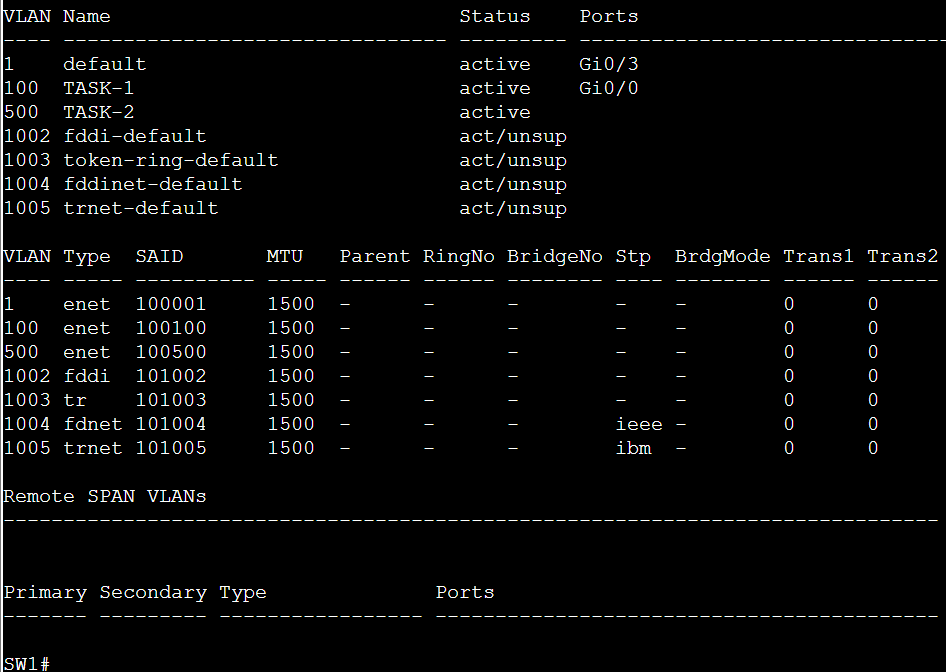

### 🔹 show vlan id 100

### 🔹 show vlan name TASK-1
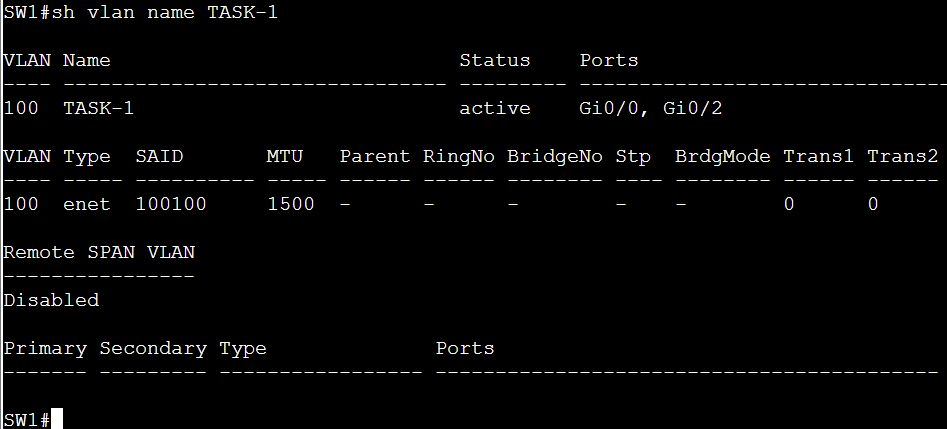

### 🔹 show vlan brief

### 🔹 show vlan summary
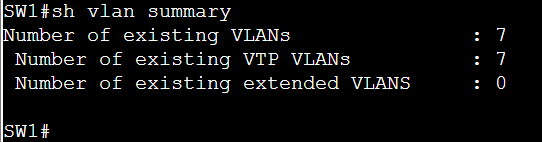

---

### 🔸 show interfaces trunk
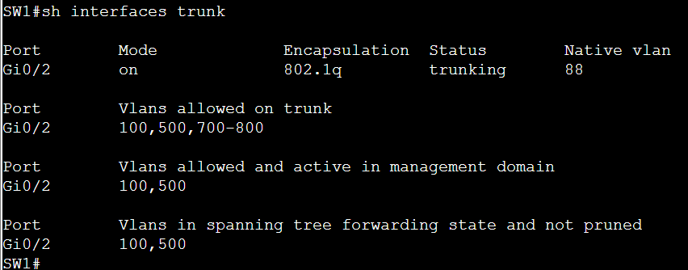

### 🔸 show interfaces status
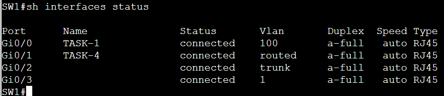

### 🔸 show interfaces g0/0 switchport
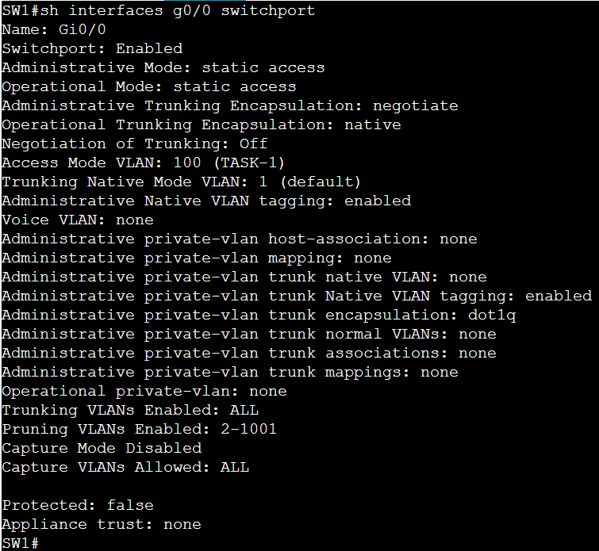

---

### 🔻 show mac address-table
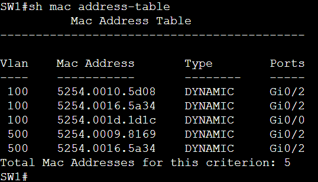

### 🔻 show mac address-table vlan 100
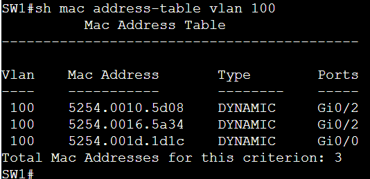

### 🔻 show mac address-table interface g0/2

### 🔻 show mac address-table dynamic
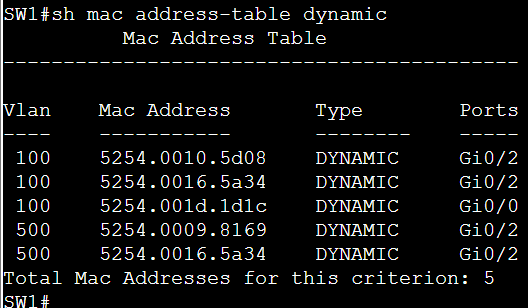

### 🔻 show mac address-table address 5254.0016.5a34
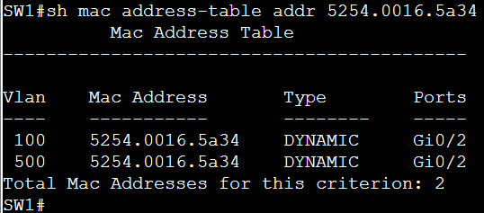

### 🔻 show mac address-table aging-time
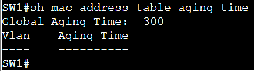

---

### show ipv6 interface brief
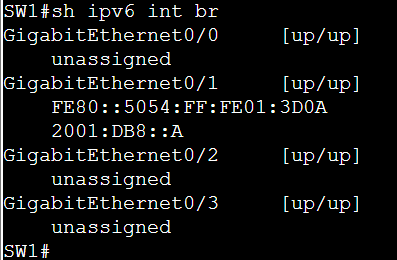

---

> 📝 Use these outputs to confirm your configuration is functioning as expected. Make sure VLANs, trunking, and MAC address table details match the lab goals.

"""