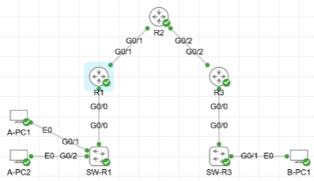

# 🔁 ENCOR CH1 Layer 3 Forwarding

## 📘 Project Overview

This project provides a lab environment built in **Cisco CML** for hands-on practice with **Layer 3 forwarding and routing concepts**.

The lab **ENCOR_CH1_Layer_3_Forwarding.yaml** is pre-configured with:

- A multi-router topology with OSPF routing
- End devices with pre-set IP addressing
- Partially pre-configured routers and switches

## 🧪 Environment

- **Platform:** Cisco CML  
- **Device Types:** IOSv / IOSvL2 / Desktop

## 🎯 Task

Your goal is to verify Layer 3 connectivity across multiple subnets. Specifically, you should:

1. Ensure end-to-end IP connectivity between:
   - A-PC1 ↔ A-PC2
   - A-PC1 ↔ B-PC1
2. Validate routing tables, ARP entries, and CEF information.

> 🔍 Use notes embedded in the lab topology in Cisco CML for more context and detailed instructions.

## 🖼️ Topology

Below is the high-level topology used in this lab:

## ✅ Goal

After completing the lab:

- You should know all important show commends 

Compare your results with the example solution in the `solution/` directory.

Happy labbing! 🚀