# 🧠 ENCOR: Layer 3 Forwarding – ARP, Routing, Adjacency & CEF

## 🧾 Commands used:

### 🔍 ARP Commands
- `show arp`
- `show arp 10.0.1.10`
- `show arp 10.0.1.10 detail`
- `show arp interface`
- `show arp summary`
- `show arp dynamic`
- `show arp incomplete`

### 📡 IP Interface and Routing
- `show ip interface brief | exclude unassigned`
- `show ip route | begin Gateway`
- `show ip route 192.168.50.0 longer-prefixes | begin Gateway`
- `show ip route 192.168.50.0 255.255.255.0`

### 🤝 Adjacency Table
- `show adjacency`
- `show adjacency gigabitEthernet0/1 detail`
- `show adjacency summary`
- `show adjacency encapsulation`
- `show adjacency link ipv4`

### ⚙️ Cisco Express Forwarding (CEF)
- `show cef fib`
- `show cef gigabitEthernet0/1`
- `show cef state`

## 📷 Screenshot

### 🔹 show arp
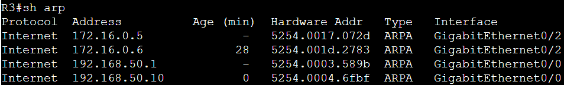

### 🔹 show arp 10.0.1.10
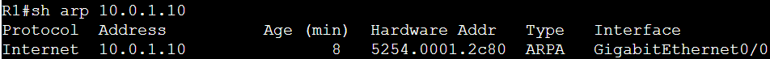

### 🔹 show arp 10.0.1.10 detail
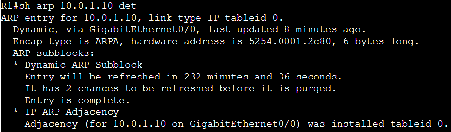

### 🔹 show arp interface
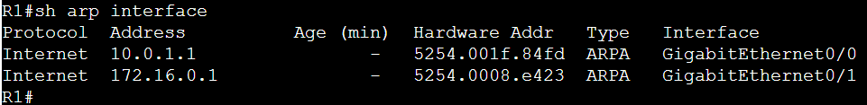

### 🔹 show arp summary
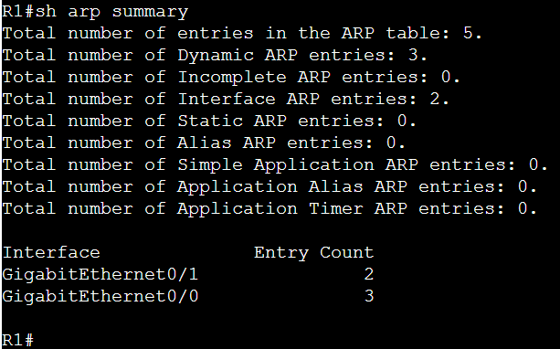

### 🔹 show arp dynamic
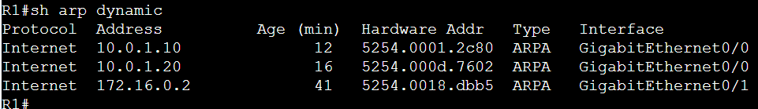

### 🔹 show arp incomplete
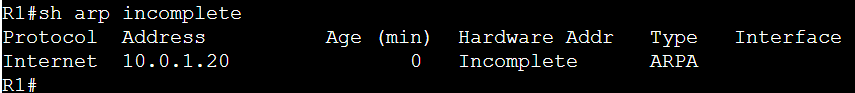

### 🔹 show ip interface brief | exclude unassigned
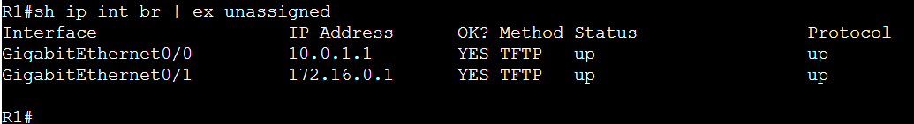

### 🔹 show ip route | begin Gateway
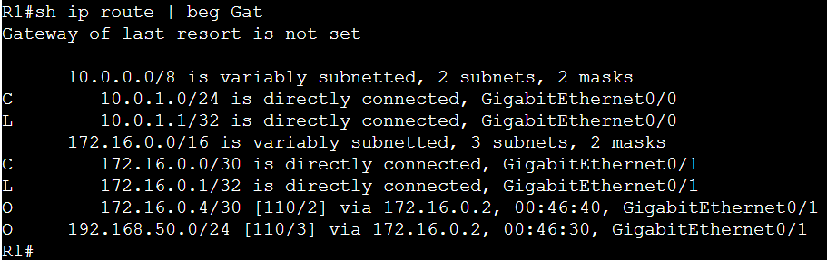

### 🔹 show ip route 192.168.50.0 longer-prefixes | begin Gateway
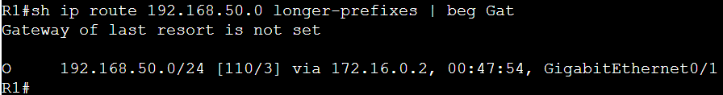

### 🔹 show ip route 192.168.50.0 255.255.255.0
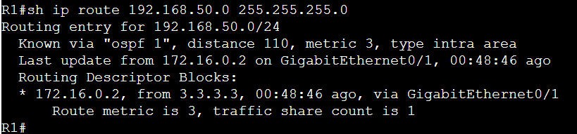

### 🔹 show adjacency
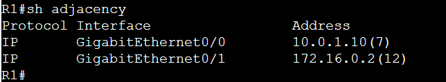

### 🔹 show adjacency gigabitEthernet0/1 detail
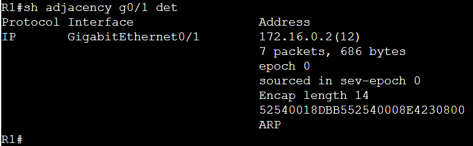

### 🔹 show adjacency summary
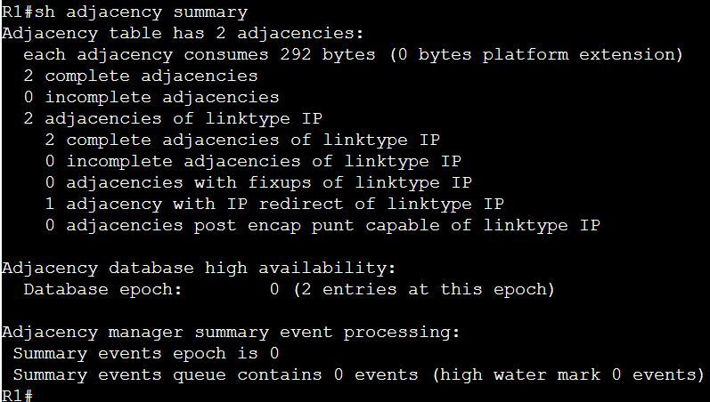

### 🔹 show adjacency encapsulation
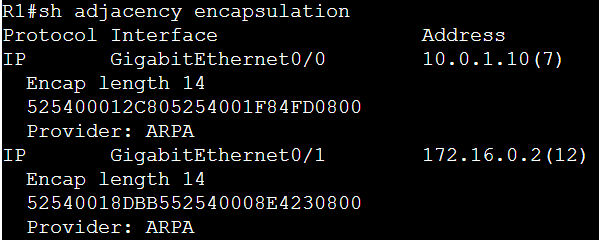

### 🔹 show adjacency link ipv4
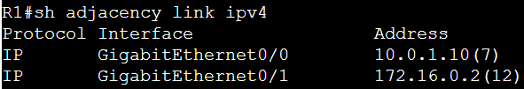

### 🔹 show cef fib
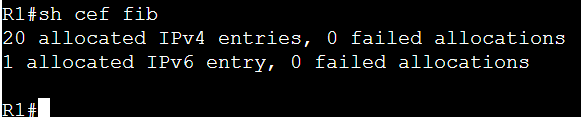

### 🔹 show cef gigabitEthernet0/1
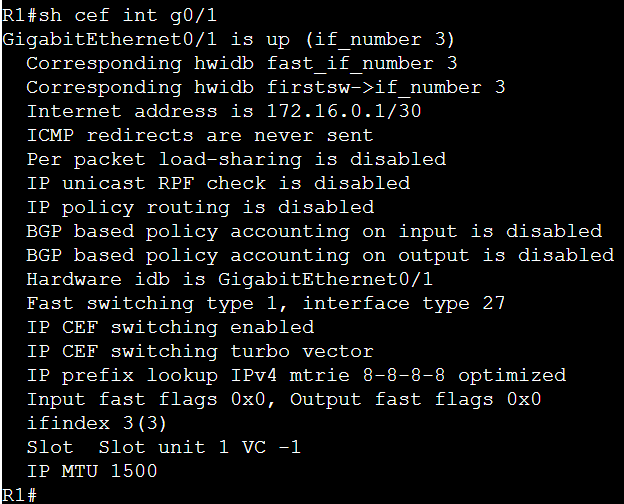

### 🔹 show cef state
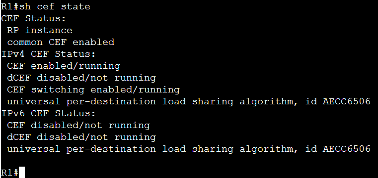
