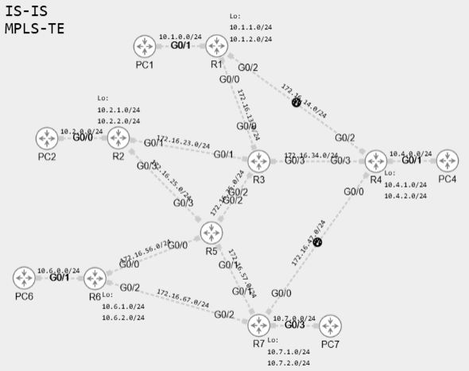

# 📡 MPLS-TE + FRR + CBTS Lab

## 📘 Project Overview

This project delivers a comprehensive lab environment for practicing advanced **MPLS Traffic Engineering (MPLS-TE)**, **Fast Reroute (FRR)**, **Class-Based Tunnel Selection (CBTS)** and **Policy-Based routing** using **Cisco CML**.

The lab **MPLS_Traffic_Engineering_2.yaml** is pre-configured with:

- Full IP addressing and loopbacks,
- **IS-IS with TE extensions** as the IGP,
- RSVP-based **MPLS-TE tunnels**

## 🧪 Environment

- **Platform:** Cisco CML
- **Router Type:** IOSv
- **Routing Protocol:** IS-IS with TE extensions and BFD
- **Signaling Protocol:** RSVP-TE

## 🎯 Task

Your tasks include configuring multiple **MPLS-TE tunnels** based on complex criteria:

1. Tunnel R4↔R6 with per-IPP path constraints (delay/affinity),
2. Tunnel R1→R7 with fastest path and **node-protection** (via R2),
3. Tunnel R1←R7 with **explicit path** (high performance) and **link-protection** (R7→R5),
4. Tunnel R2→R7 with static path (R2→R5→R7) and **path-protection** via R2→R3→R4→R7,
5. Tunnel R2→R4 avoiding R3, with dynamic backup (reduced BW),
6. Tunnel R2←R4 for PBR only on `10.2.0.0/24`.

You must also configure **link affinities and metrics** according to the following topology rules:

- **Affinity 0x11000000 (GOLD – includes SILVER):**
  - R1↔R3  
  - R3↔R5  
  - R5↔R7  

- **Affinity 0x01000000 (SILVER):**
  - R5↔R6  
  - R3↔R4  

- **Affinity 0x00F00000 (High delay):**
  - R1↔R4  
  - R4↔R7  

- **Administrative-weight (5x faster connection):**
  - R2↔R3  
  - R2↔R5  

> 🔍 All instructions and detailed scenarios are embedded in lab notes and visual annotations. Please inspect the simulation for embedded hints.

## 🖼️ Topology

Below is the high-level topology used in this lab:

> If the topology image is not visible, please open `topology.png` located in the root of the project folder.

## ✅ Goal

Upon completion, the following features should be operational:

- Multiple **MPLS-TE tunnels** with varying attributes,
- **Fast Reroute (FRR)** with both link and node protection,
- Path selection based on **affinity, delay, and performance**,
- Support for **PBR** in specific routing scenarios.

Compare your results with the example solution in the `solution/` directory.

Happy labbing! 🚀
